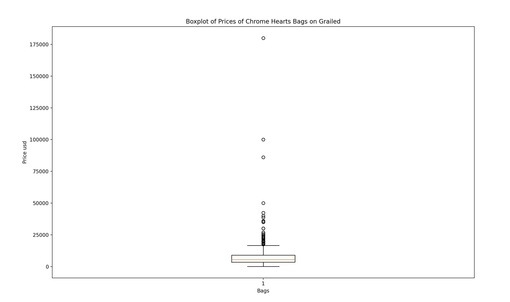

# Grailed Scraper

This is a project to web scrape the website Grailed. Grailed is an online marketplace for new and secondhand clothes or accessories. 

# Built With

This project is built using Selenium, Psycopg2, Matplotlib, and PostgreSQL

# How to use

This project consists of two python files: scraper.py and dbscripts.py. After setting up a PostgreSql database go to the end of the dbscript.py file and change the connection details to your information, then uncomment the create table function and run the file to create a table called grails in your database. Then you can run scraper.py which will grab all listings on the webpage defined in the PAGE_TO_SCRAPE variable. The program first scolls all the way down the page to collect links to all the listings and then will visit each link to collect data for each listings and add it to the database. A page with 1000 listings will take about 17 mintues to run. After data is collected, you can uncomment the functions at the bottom of dbscripts.py to see some data analysis.

# In Action

I used Grailed Scraper to Scrape every listing under Chome Hearts Bag. https://www.grailed.com/designers/chrome-hearts/bags-luggage

A screenshot is taken after every scroll. Here is the screenshot taken after the final scroll. 

A screenshot is taken after every link is visited.

I also recorded a video of the scraper in action. Scrolling begins at 0:04 and link visiting begins at 0:34.

<video width="1000" height="800" controls> <source src="./pictures/grailed scraper in action.mov" type="video/mp4"> </video>

After the data was collected, I ran some functions in dbscripts.py to analyze the data. 

below is graphConditions(grails)

below is graphPrice(grails)

